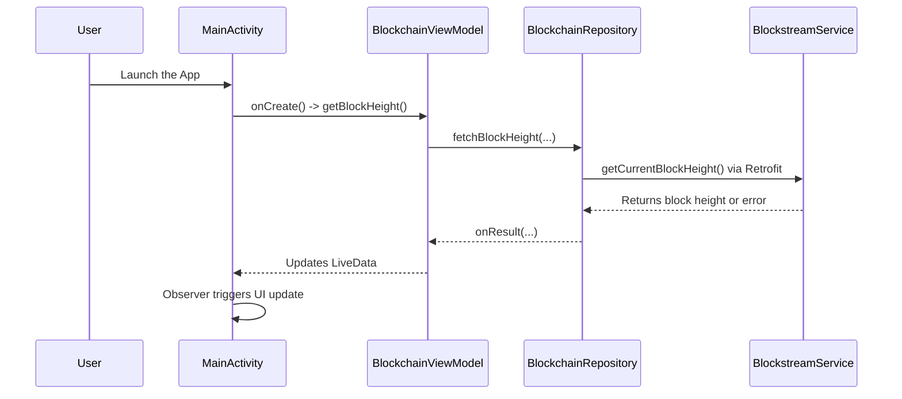
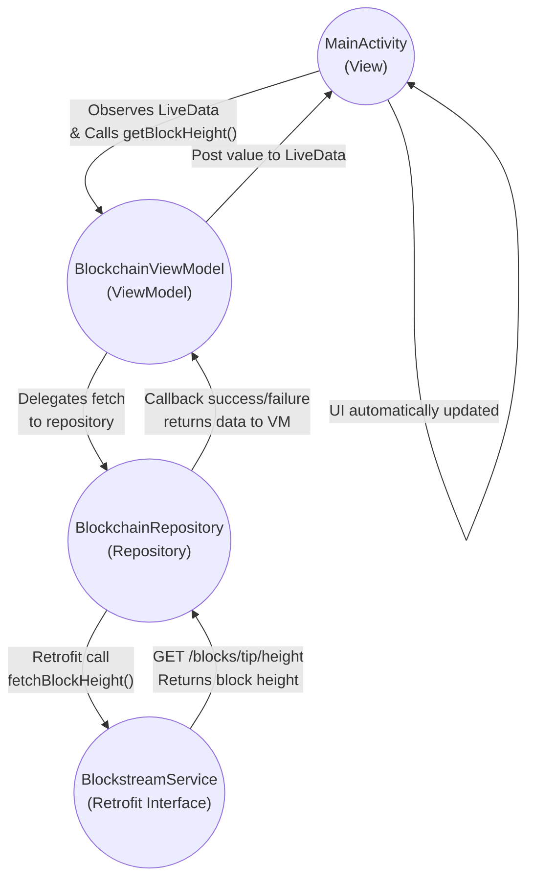

# BlockHeightMonitor

BlockHeightMonitor is a simple Android app demonstrating **MVVM Architecture** combined with **Retrofit**, **ViewModel**, **LiveData**, and **Repository** patterns. It fetches and displays the **current Bitcoin block height** from [Blockstream’s API](https://blockstream.info/).

---

## 📱 Features
- **MVVM Architecture** for clean separation of concerns.
- **Retrofit** for network requests.
- **LiveData + ViewModel** for real-time UI updates.
- Targets **Android 12+**, optimized with Jetpack libraries.
- **Kotlin-first** approach with coroutine or callback-based APIs.

---

## 🏛️ Architecture Overview

This project follows a **Model-View-ViewModel (MVVM)** architecture:

```
View (MainActivity) ➡️ ViewModel ➡️ Repository ➡️ Retrofit Service ➡️ Blockstream API
                ⬆️ (LiveData Updates)
```

| Layer         | Responsibility                                           |
| ------------- | -------------------------------------------------------- |
| View          | Observes LiveData, triggers `getBlockHeight()`           |
| ViewModel     | Holds LiveData, delegates fetch logic to Repository      |
| Repository    | Handles network logic and returns results via callbacks  |
| Retrofit      | Defines API service and manages HTTP communication       |

---

## 🖼️ Diagrams

### Sequence Diagram




### Flow Diagram



---

## ⚙️ Requirements
- **Android Studio Flamingo** (or newer)
- **Gradle 8.x** with Android Gradle Plugin 8.x
- Internet permission in `AndroidManifest.xml`:
```xml
<uses-permission android:name="android.permission.INTERNET" />
```

---

## 🚀 Getting Started

### Clone the Repository
```bash
git clone https://github.com/YourUsername/BlockHeightMonitor.git
cd BlockHeightMonitor
```

### Open in Android Studio
1. File ➡️ Open ➡️ Select `BlockHeightMonitor` folder.
2. Let Gradle sync.

### Run the App
- On emulator or physical device.
- Ensure Internet connection is active.

---

## 📲 Usage
1. Launch the app.
2. It automatically fetches the current block height from:
   ```
   https://blockstream.info/api/blocks/tip/height
   ```
3. Displays the block height in a **TextView** (e.g., `Block Height: 784123`).

---

## 📂 Project Structure

```
BlockHeightMonitor/
 ├─ app/
 │   ├─ src/main/java/com/example/blockheightmonitor/
 │   │   ├─ data/api/BlockstreamService.kt
 │   │   ├─ data/repository/BlockchainRepository.kt
 │   │   ├─ ui/MainActivity.kt
 │   │   └─ ui/viewmodel/BlockchainViewModel.kt
 │   ├─ src/main/res/layout/activity_main.xml
 │   └─ build.gradle
 ├─ diagrams/
 │   ├─ sequence-diagram.png
 │   ├─ flow-diagram.png
 │   └─ architecture.jpeg
 ├─ README.md
 ├─ LICENSE
 └─ gradle.properties
```

---

## 📖 Additional Notes
- **ScalarsConverterFactory** is used for parsing plain-text responses.
- For JSON APIs, you can switch to **GsonConverterFactory**.
- Don’t forget the `android:exported="true"` attribute for Android 12+.

---

## 📝 License
This project is licensed under the [MIT License](LICENSE).
